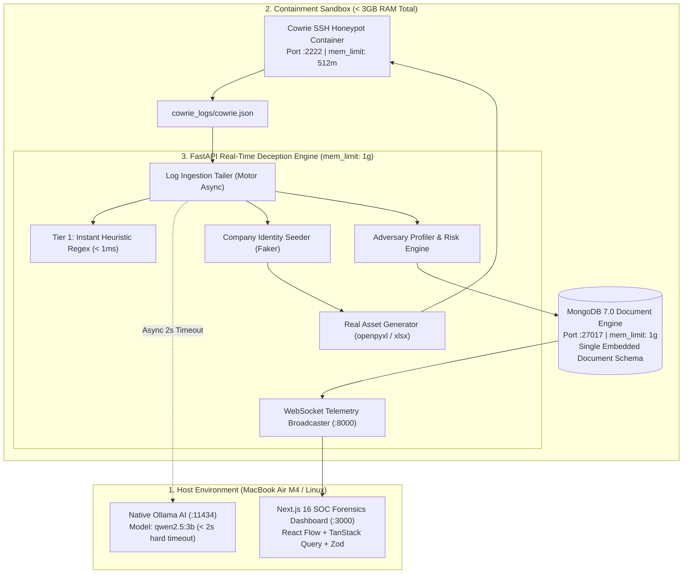

<div align="center">

# 🍯 HoneyNet

### **An AI-powered adaptive honeynet that builds a unique fake company around each attacker in real time.**

[](https://opensource.org/licenses/MIT)
[](https://github.com/prathameshmore07/honeynet/actions)
[](https://www.docker.com/)
[](https://www.python.org/)
[](https://nextjs.org/)
[](https://ollama.ai/)
[](https://apple.com)

<br/>

<!-- ============================================================================== -->
<!-- DEMO GIF HERE                                                                  -->
<!-- Replace the placeholder below with the launch recording GIF/video (demo.gif)  -->
<!-- ============================================================================== -->
<p align="center">
  
</p>

</div>

---

## ⚡ Why HoneyNet?

Traditional honeypots rely on static fake filesystems. Experienced attackers immediately spot the lack of authentic developer secrets, company payroll records, or database backups and disconnect within seconds.

**HoneyNet** watches incoming SSH commands, infers adversary tactical intent in real time, and dynamically deploys **authentic, formatted fake assets** matching that intent.

```
Attacker: "ls -la /home/phil"
HoneyNet: [Instant Regex Match: Intent = Finance]
HoneyNet: [Faker Engine -> Seeds "Apex Holdings Ltd." (Tax ID: 88-1928371, Domain: apexholdings.io)]
HoneyNet: [openpyxl Engine -> Drops genuine binary Payroll_2026_Confidential.xlsx with 8 executive salaries]
Attacker: "cat Payroll_2026_Confidential.xlsx" -> Attacker stays engaged; SOC gathers forensic attribution.
```

---

## 📊 Comparison: HoneyNet vs. Traditional Deception

| Feature / Capability | Traditional Honeypot (Cowrie Alone) | Commercial Cyber Deception | **HoneyNet (AI Adaptive)** |
| :--- | :--- | :--- | :--- |
| **Adaptiveness** | ❌ None (Static filesystem) | ⚠️ Rule-based static decoys | ✅ **Real-Time Dynamic Deception** |
| **Asset Personalization** | ❌ Generic placeholder files | ⚠️ Manual template configuration | ✅ **Unique Fake Company per Attacker** |
| **Spreadsheet Realism** | ❌ Plain text / Fake shell errors | ⚠️ Mock CSV templates | ✅ **Genuine Binary Excel (`.xlsx`) via openpyxl** |
| **AI Inference Latency** | ❌ No AI integration | ⚠️ Cloud API calls (5–10s lag) | ✅ **$< 1\text{ms}$ Baseline + $\le 2\text{s}$ Async Ollama** |
| **Cost & Privacy** | 🟢 Free (Self-hosted) | 🔴 $20k–$100k+/year (Enterprise) | 🟢 **100% Free & Self-Hosted (No Cloud Billing)** |
| **Resource Efficiency** | 🟢 Low memory | 🔴 High VM overhead | 🟢 **$< 3\text{GB}$ Docker RAM (M4 Apple Silicon Tuned)** |

---

## 📐 System Architecture



---

## 🚀 Quick Start (3 Commands)

```bash
# 1. Clone the repository
git clone https://github.com/prathameshmore07/honeynet.git && cd honeynet

# 2. Launch the unified platform (FastAPI + Next.js + Cowrie)
chmod +x start.sh && ./start.sh

# 3. In another terminal, trigger a realistic attack simulation
python3 honeypot_sim.py --scenario finance
```

* 📊 **Forensics Lab SOC Dashboard:** [http://localhost:3000](http://localhost:3000)
* 🔌 **FastAPI Telemetry Backend:** [http://localhost:8000](http://localhost:8000) (Swagger Docs: `/docs`)
* 🍯 **Cowrie SSH Honeypot:** `ssh root@localhost -p 2222`

---

## 🛠️ Tech Stack

| Domain | Technology | Description |
| :--- | :--- | :--- |
| **Honeypot Ingress** |  | Low-to-medium interaction SSH daemon in container sandbox |
| **Backend & WS** |  | Asynchronous API & WebSocket event broadcaster |
| **Database** |  | Single-collection embedded-document persistence with Motor |
| **Local AI Engine** |  | Metal/MLX accelerated local LLM for intent attribution |
| **Asset Synthesis** |   | Formatted `.xlsx` workbooks and corporate employee identity generation |
| **SOC Dashboard** |   | Forensics Lab UI (`#0B0D10` palette, `IBM Plex Mono`) |
| **Attack Graph** |  | Interactive lateral movement & pivot topology canvas |

---

## 🗺️ Roadmap & Future Milestones

The following capabilities are planned for upcoming releases:

- [ ] **Multi-Hop Web Application Decoys:** Lightweight simulated web applications (e.g. simulated internal GitLab issue tracker and HR salary lookup portal).
- [ ] **RDP Graphical Honeypot Decoys:** Low-interaction Windows RDP decoy nodes with fake desktop icons and simulated browser histories.
- [ ] **Automated Payload Detonation Sandbox:** Safe, isolated micro-VM sandboxing for dropped ELF/script binaries with MITRE behavioral tagging.
- [ ] **STIX 2.1 Threat Intel Export:** Automated packaging of session attack graphs into standard STIX 2.1 intelligence bundles for SIEM ingestion.

---

## 🤝 Contributing

Contributions are welcome! Please check out [CONTRIBUTING.md](file:///Users/prathamesh/Desktop/x/CONTRIBUTING.md) for local development guidelines and [Good First Issues](file:///Users/prathamesh/Desktop/x/CONTRIBUTING.md#good-first-issues--starter-tasks).

---

## 📄 License

This project is licensed under the [MIT License](file:///Users/prathamesh/Desktop/x/LICENSE).
