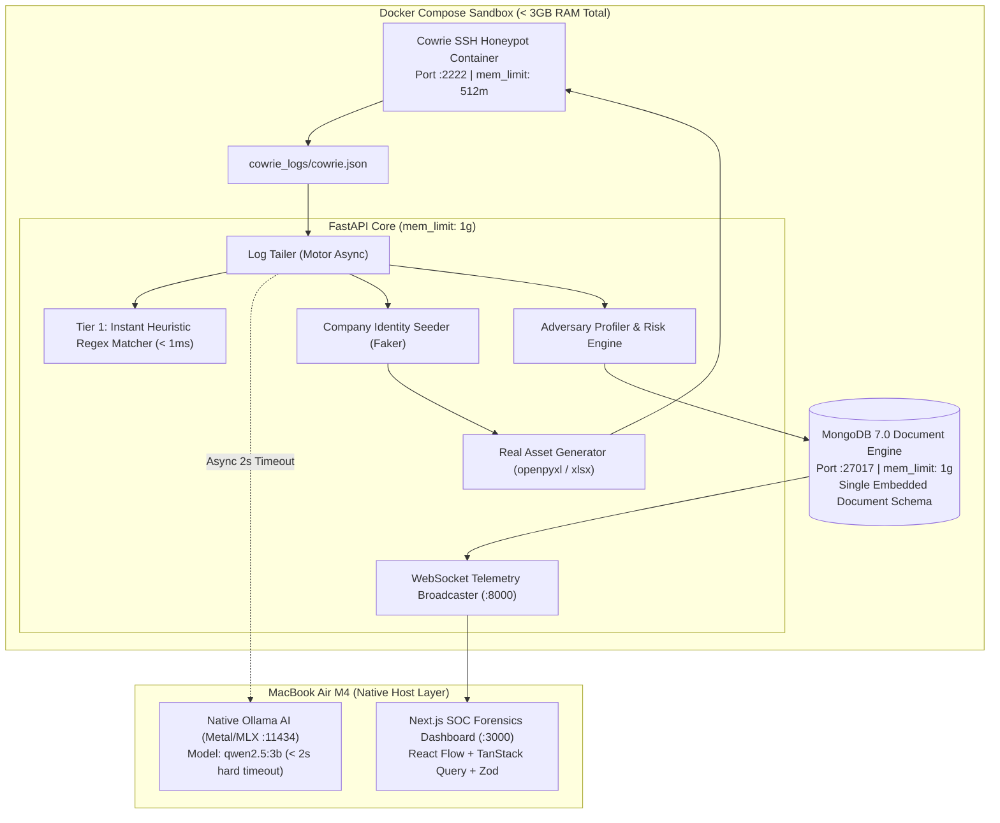

# HoneyNet: AI-Powered Cyber Deception & Autonomous Honeytoken Honeynet (V1)

**HoneyNet** is an autonomous cyber deception system tailored specifically for Apple Silicon (MacBook Air M4, 16GB RAM, 256GB SSD). It detects attacker reconnaissance commands in real time, infers tactical intent using sub-millisecond regex matching enriched by local Ollama AI (`qwen2.5:3b`), and dynamically provisions authentic fake corporate assets (`.xlsx` spreadsheets created with `openpyxl`, `.csv`, `.env` tokens, and wire memos) populated with consistent company identities generated by `Faker`.

---

## 🎯 Target Hardware & Performance Constraints (MacBook Air M4)

* **RAM Footprint (< 3GB Docker / 16GB Total):** Docker memory is strictly capped (`cowrie`: 512MB, `mongodb`: 1GB, `backend`: 1GB) to ensure zero paging and smooth macOS performance.
* **Native Apple Silicon AI:** Ollama runs **natively on macOS** to leverage Metal/MLX hardware acceleration (Docker Ollama is CPU-only and slow on ARM).
* **Storage Footprint (< 2GB Total):** Uses quantized 3B LLM (`qwen2.5:3b-instruct` or `qwen2.5:1.5b`), maintaining > 20GB of free SSD space.
* **Instant Deception Response:** Rule-based heuristic matcher responds in $< 1\text{ms}$; Ollama runs asynchronously with a hard **2.0s timeout**.

---

## 📋 Scope Boundaries

### ✅ In V1 Scope
* **SSH Honeypot:** Cowrie container with `AuthRandom` password simulation and fake filesystem sandbox.
* **Finance & Credential Intent:** Detects targeting of payroll spreadsheets, executive compensation, `.env` developer secrets, and AWS CLI keys.
* **Authentic Binary Asset Generation:** Uses `openpyxl` to generate formatted Microsoft Excel (`.xlsx`) workbooks and matching `.csv` files.
* **Consistent Identity Seeder:** Python `Faker` seeds one consistent company identity per session (matching corporate domain, executive roster, salaries, and tax IDs across all files).
* **Forensics Lab SOC Dashboard:** Next.js 16 + React Flow lateral movement graph (~60% hero layout), live command feed (`aria-live`), MITRE ATT&CK heatmap, and Deception Evidence Vault.
* **Single-Session Embedded MongoDB:** Motor async driver with atomic `$push` and `$set` embedded document model.

### 🚫 NOT In V1 Scope (Deferred to Future Releases)
1. **Simulated AWS Management Web Console:** Cloud deception is delivered via CLI artifacts (`~/.aws/credentials`, `aws s3` CLI bait) rather than a full fake AWS web portal.
2. **Simulated GitLab / Jenkins Web Portal UI:** Code repository deception is delivered via local git repos and `.env` files in the Cowrie sandbox.
3. **Multi-Hop RDP Graphical Honeypot:** V1 focuses strictly on low/medium-interaction SSH.
4. **Automated Malware Binary Disassembler:** Focuses on tactical intent inference rather than static binary analysis.

---

## 📐 System Architecture



---

## 📂 Repository Structure

```text
.
├── backend/
│   ├── asset_generator.py      # Authentic binary Excel (.xlsx) and CSV generator (openpyxl)
│   ├── classifier.py           # Instant regex classifier + async 2s native Ollama caller
│   ├── config.py               # pydantic-settings environment configuration
│   ├── db.py                   # MongoDB embedded-document persistence with SQLite fallback
│   ├── expansion_engine.py     # Lateral movement graph builder for React Flow
│   ├── identity_seeder.py      # Faker company identity seeder (domain, employees, salaries)
│   ├── log_tailer.py           # Real-time Cowrie log ingestion worker
│   ├── logger.py               # Structured JSON log formatter
│   ├── main.py                 # FastAPI REST API and WebSocket /ws/live endpoint
│   ├── mitre_mapper.py         # MITRE ATT&CK signature matcher and risk calculator
│   ├── models.py               # Pydantic schemas and MongoDB SessionDoc models
│   ├── profiler.py             # Attacker sophistication and risk scoring engine
│   └── ws_manager.py           # Thread-safe WebSocket broadcaster
├── frontend/
│   ├── app/
│   │   ├── globals.css         # Forensics Lab design tokens (#0B0D10, #14171C, #4A9EFF)
│   │   ├── layout.tsx          # IBM Plex Mono + Inter font loaders, ReactQueryProvider
│   │   └── page.tsx            # Asymmetric 60% Hero React Flow layout
│   ├── components/
│   │   ├── ErrorBoundary.tsx   # Panel-level error boundary with recovery UI
│   │   ├── ui/                 # Card, Badge, StatItem, Skeleton primitives
│   │   └── features/           # Header, AttackPathGraph, LiveCommandFeed, MitreHeatmap, AssetInventory
│   ├── lib/
│   │   ├── api.ts              # Typed API client with Zod validation
│   │   ├── queryClient.tsx     # TanStack React Query cache provider
│   │   ├── schemas.ts          # Strict Zod schemas for all backend models
│   │   └── useWebSocket.ts     # Resilient WebSocket hook with latency ping tracker
│   └── package.json            # Next.js 16, React Flow (@xyflow/react), Tailwind CSS v4
├── cowrie_config/              # Cowrie daemon configuration and honeyfs mount
├── cowrie_logs/                # Real-time cowrie.json log stream
├── docker-compose.yml          # Multi-container orchestration with memory limits
├── honeypot_sim.py             # Scripted attack telemetry simulator (V1 scope)
├── start.sh                    # One-click unified launch script
├── requirements.txt            # Python dependencies (motor, openpyxl, faker, fastapi)
└── README.md                   # System documentation
```

---

## 🚀 Quick Start Guide (MacBook Air M4)

### 1. Prerequisites
* **Python 3.10+** and **Node.js 18+**
* **Native Ollama (Optional for full AI mode):**
  ```bash
  brew install ollama
  ollama serve
  ollama pull qwen2.5:3b
  ```
  *(Note: If Ollama is not running, HoneyNet automatically operates in zero-latency heuristic mode with 100% functionality).*

### 2. One-Click Launch
```bash
# Clone repository
git clone https://github.com/prathameshmore07/honeynet.git
cd honeynet

# Run unified launcher
chmod +x start.sh
./start.sh
```

The script will:
1. Initialize the Python environment and verify dependencies (`faker`, `openpyxl`, `motor`).
2. Check native Ollama status.
3. Start **FastAPI Backend** on `http://localhost:8000`.
4. Start **Next.js Forensics Lab Dashboard** on `http://localhost:3000`.

---

## 🎯 Testing with the Scripted Attack Simulator

Run the built-in attack simulator to generate realistic attack telemetry:

```bash
# Test Corporate Finance & Payroll Spreadsheet Exfiltration
python3 honeypot_sim.py --scenario finance --delay 0.4

# Test Developer Secret (.env) Mining
python3 honeypot_sim.py --scenario git --delay 0.3

# Test AWS Cloud Credentials Discovery
python3 honeypot_sim.py --scenario aws --delay 0.4
```

### Observe on the Dashboard:
1. **Live Command Feed:** Observe real-time commands streaming into the monospace terminal.
2. **Dynamic Canary Deployment:** Check the **Deception Evidence Vault** to see newly provisioned `Payroll_2026_Confidential.xlsx` files matching the company identity.
3. **Lateral Movement Graph:** Watch the React Flow graph update active and targeted nodes dynamically.
4. **MITRE ATT&CK Heatmap:** See tactical techniques (`T1005`, `T1552.001`, `T1082`, `T1083`) highlight in real time.
