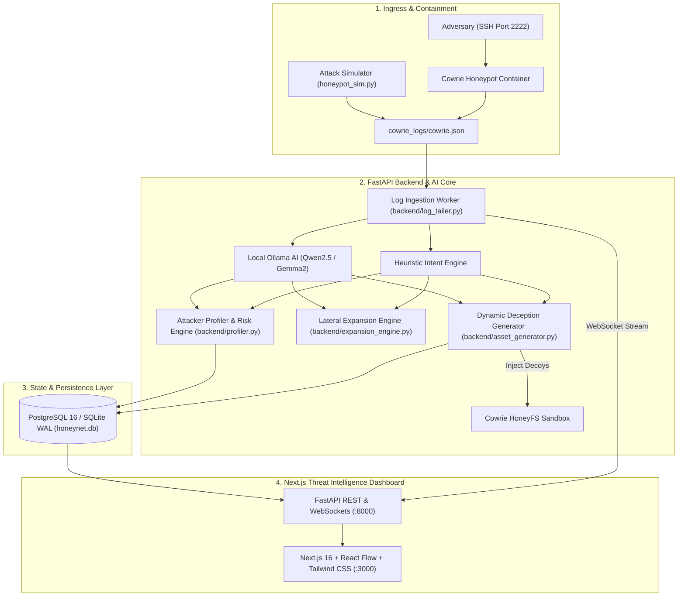

# HoneyNet: AI-Powered Adaptive Cyber Deception & Autonomous Honeytoken Honeynet

**HoneyNet** is an enterprise-grade cyber deception platform that analyzes adversary commands in real time, infers tactical intent using local Large Language Models (Ollama Qwen2.5 / Gemma2) with fallback heuristics, and dynamically provisions realistic synthetic canary assets directly into Cowrie's virtual filesystem to entrap attackers, profile their TTPs, and map lateral movement across enterprise networks.

---

## 🛡️ Key Features

* **⚡ Real-Time Ingestion & WebSocket Streaming:** Sub-second event ingestion from Cowrie SSH honeypots streamed directly to the Next.js SOC Dashboard via bidirectional WebSockets (`/ws/live`).
* **🧠 Dual-Layer AI Intent Classification:** Asynchronous Ollama LLM intent inference coupled with deterministic regex-based fallback for zero-downtime classification (Credentials, Cloud/AWS, Finance, Source Code, HR/PII).
* **🕸️ Lateral Movement & React Flow Graph:** Visualizes attack paths across simulated enterprise topology (`Ubuntu Bastion` $\rightarrow$ `GitLab` $\rightarrow$ `Jenkins` $\rightarrow$ `AWS VPC` $\rightarrow$ `PostgreSQL DB` $\rightarrow$ `Finance Vault` $\rightarrow$ `Executive Workstation`).
* **📁 Dynamic Deception Honeytoken Generator:** Injects synthetic, believable canary artifacts (mock environment templates, fake git repositories, sanitized AWS CLI credentials, employee rosters, and database dumps) on-demand into Cowrie's virtual sandbox.
* **🎯 MITRE ATT&CK Matrix & Threat Scoring:** Maps commands to ATT&CK techniques with an interactive heatmap and composite risk index (0–100).
* **🕵️ Automated Threat Actor Profiling:** Evaluates sophistication tiers (*Script Kiddie*, *Opportunistic*, *APT/Sophisticated*), infers campaign objectives, and generates executive AI incident narratives.
* **🚀 100% Free & Self-Hostable:** Zero paid APIs or cloud dependencies. Runs entirely local on Docker or standalone.

---

## 📐 System Architecture



---

## 📂 Repository Structure

```text
.
├── backend/
│   ├── asset_generator.py      # Dynamic synthetic honeytoken and bait file generator
│   ├── asset_manager.py        # Deception asset catalog and honeyfs seeding
│   ├── classifier.py           # Ollama LLM integration and heuristic intent engine
│   ├── config.py               # Environment configuration and path resolution
│   ├── db.py                   # PostgreSQL & SQLite dual-storage persistence layer
│   ├── expansion_engine.py     # Lateral movement graph builder for React Flow
│   ├── log_tailer.py           # Cowrie JSON log ingestion & event dispatching
│   ├── main.py                 # FastAPI REST API and WebSocket /ws/live endpoint
│   ├── mitre_mapper.py         # MITRE ATT&CK signature matcher and risk calculator
│   ├── models.py               # Pydantic schemas and database models
│   ├── profiler.py             # Attacker sophistication and threat scoring engine
│   └── ws_manager.py           # Thread-safe WebSocket connection broadcaster
├── frontend/
│   ├── app/
│   │   ├── globals.css         # Cyber SOC dark theme & React Flow styling
│   │   ├── layout.tsx          # Root layout and metadata
│   │   └── page.tsx            # Main SOC Command Center dashboard page
│   ├── components/
│   │   ├── AssetInventory.tsx  # Dynamic deception canary asset table
│   │   ├── AttackPathGraph.tsx # Interactive React Flow lateral movement diagram
│   │   ├── AttackerProfileCard.tsx # Threat actor profiling and risk gauge
│   │   ├── Header.tsx          # SOC status bar and simulator launcher
│   │   ├── LiveCommandFeed.tsx # Real-time streaming terminal with filters
│   │   ├── MetricsOverview.tsx # KPI summary cards
│   │   ├── MitreHeatmap.tsx    # MITRE ATT&CK technique matrix visualizer
│   │   └── SimulatorModal.tsx  # One-click demo scenario trigger modal
│   └── package.json            # Next.js, React Flow, Tailwind dependencies
├── cowrie_config/
│   ├── cowrie.cfg              # Honeypot daemon configuration (AuthRandom enabled)
│   └── honeyfs/                # Virtual filesystem mounted into container
├── cowrie_logs/                # Real-time destination for cowrie.json event stream
├── templates/                  # Source templates for synthetic enterprise bait
│   ├── aws/                    # Mock credentials, S3 manifests, EC2 topologies
│   ├── finance/                # Payroll CSVs, wire transfer memos, budgets
│   ├── git/                    # Mock repos, .env templates, commit histories
│   └── hr/                     # Employee directory, executive contracts, org charts
├── docker-compose.yml          # Full multi-container stack orchestration
├── honeypot_sim.py             # Multi-session attack traffic simulator
├── start.sh                    # One-click unified local launch script
├── requirements.txt            # Python dependencies
└── README.md                   # System documentation
```

---

## 🚀 Quick Start Guide

### Option 1: One-Click Local Launch (Recommended for Development)

Ensure Python 3.10+ and Node.js 18+ are installed:

```bash
# 1. Clone repository
git clone https://github.com/prathameshmore07/honeynet.git
cd honeynet

# 2. Make start script executable and run
chmod +x start.sh
./start.sh
```

The script will automatically:
1. Initialize the Python virtual environment and install dependencies.
2. Verify local Ollama status (or default to zero-downtime heuristic mode).
3. Seed the Cowrie HoneyFS virtual filesystem from safe templates.
4. Launch the **FastAPI Backend** on `http://localhost:8000`.
5. Launch the **Next.js SOC Dashboard** on `http://localhost:3000`.

---

### Option 2: Full Docker Compose Orchestration

Run the complete multi-service stack with a single command:

```bash
docker compose up -d
```

Services exposed:
* 📊 **Next.js SOC Dashboard:** `http://localhost:3000`
* 🔌 **FastAPI REST & WS Core:** `http://localhost:8000` (Swagger Docs: `/docs`)
* 🍯 **Cowrie SSH Honeypot:** `localhost:2222` (User: `root` or `phil`, Password: `<any>`)
* 🐘 **PostgreSQL 16:** `localhost:5432`

---

## 🎯 Testing & Demo Simulator

HoneyNet includes a built-in multi-scenario attack simulator that generates authentic Cowrie attack telemetry for live demonstrations.

### Run via Dashboard:
Click **"Launch Attack Simulator"** in the top navbar of the Next.js Dashboard and choose a campaign.

### Run via Command Line:
```bash
# Execute the full multi-stage lateral movement APT campaign
python3 honeypot_sim.py --scenario full_apt --delay 0.5

# Run targeted credential hunt
python3 honeypot_sim.py --scenario git --delay 0.3

# Run cloud infrastructure reconnaissance
python3 honeypot_sim.py --scenario aws --delay 0.4
```

---

## 🔒 Synthetic Data & Honeypot Integrity

* All credentials, tokens, AWS key IDs, payroll records, and employee data generated by HoneyNet are **100% synthetic honeypot canaries** created strictly for deception purposes.
* All `.env` files and runtime filesystems are excluded from version control via `.gitignore`.
