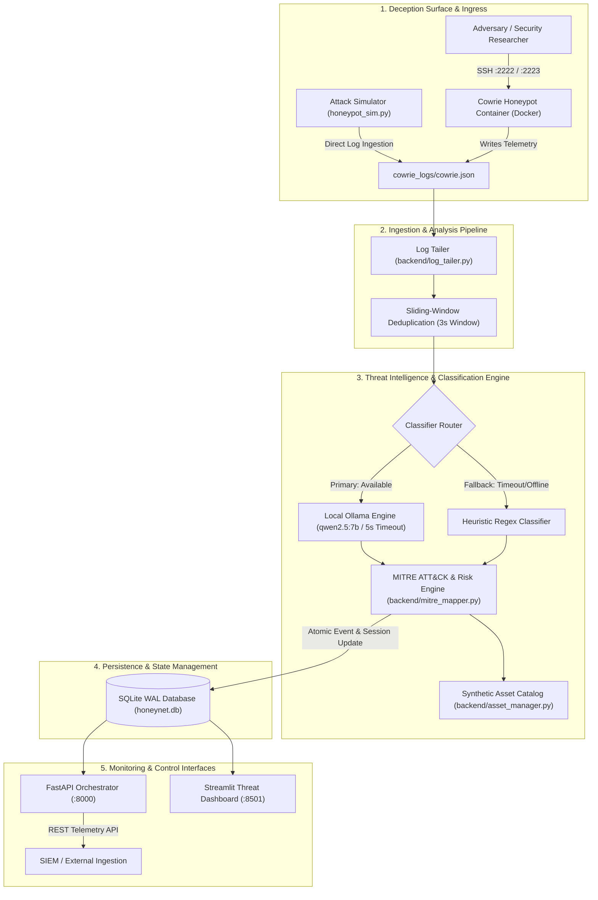
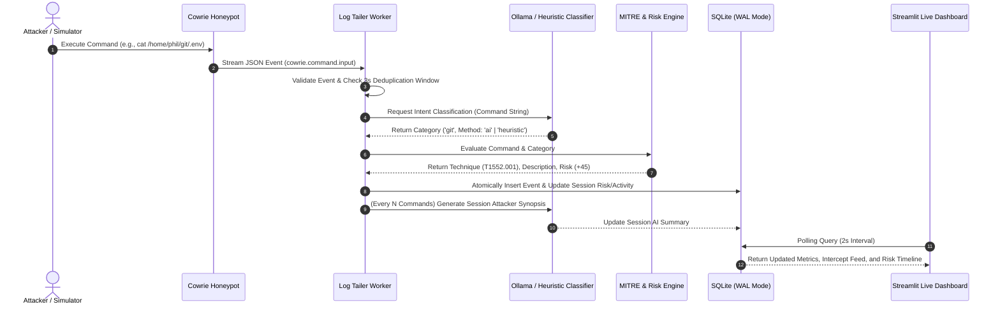

# HoneyNet: AI-Driven Adaptive Cyber Deception Honeypot

HoneyNet is an intelligent, low-interaction-to-medium-interaction cyber deception system that analyzes incoming attacker commands in real time, classifies tactical intent using a local large language model (LLM) or fallback heuristic engine, and dynamically reveals high-fidelity synthetic company assets to prolong engagement and capture forensic intelligence.

---

## Executive Summary

Traditional honeypots often rely on static fake filesystems that fail to adapt to an adversary's specific objectives, allowing experienced attackers to quickly recognize the containment environment and disconnect. HoneyNet solves this by pairing real-time command stream processing with intent classification. As an attacker executes reconnaissance and discovery commands, HoneyNet identifies whether the adversary is seeking financial records, developer secrets, cloud credentials, or human resources data, and surfaces corresponding synthetic enterprise artifacts to keep the attacker engaged while building a comprehensive forensic timeline.

### Technical Architecture Principles

* **Real-Time Command Ingestion:** Asynchronous log tailing with sliding-window deduplication processes raw Cowrie SSH honeypot telemetry with sub-second latency.
* **Dual-Tier Intent Classification:** Evaluates attacker commands via local Ollama LLMs (`qwen2.5:7b` or `gemma2:9b`) with deterministic regex-based fallback mechanisms ensuring zero-downtime classification.
* **Pre-Staged Synthetic Asset Surface:** High-fidelity, domain-specific enterprise assets (payroll records, `.env` secret files, AWS IAM configurations, executive directories) are pre-staged and cataloged for dynamic exposure tracking.
* **MITRE ATT&CK Mapping & Threat Scoring:** Ingested commands are mapped to standardized MITRE ATT&CK technique IDs with dynamic session-level risk scoring.
* **High-Concurrency Telemetry Store:** SQLite with Write-Ahead Logging (WAL mode) and busy timeouts enables concurrent multi-threaded writes from log tailers while serving read queries to REST APIs and analytics dashboards.

---

## System Architecture



---

## Data Flow & Processing Lifecycle



---

## Key Features

### 1. Dual-Tier Behavioral Intent Classification
* **Local LLM Inference:** Integrates with Ollama running quantized local models (`qwen2.5:7b`, `gemma2:9b`) via zero-temperature inference prompts for low-latency classification.
* **Deterministic Fallback:** A regex pattern matching engine guarantees classification continuity even during high load or LLM unavailability.
* **Session Summarization:** Periodically evaluates the chronological command trail of an attacker to synthesize high-level tactical intent statements.

### 2. High-Fidelity Synthetic Deception Domains
HoneyNet maintains distinct deception verticals populated with synthetic corporate data:
* **Finance:** Payroll exports, quarterly financial projections, tax filings, wire transfer authorization manifests.
* **Git & Developer Secrets:** Leaked `.env` configuration files, database connection strings, local Git repository history, authentication tokens.
* **AWS Cloud Infrastructure:** Simulated AWS credential files, S3 bucket enumeration listings, EC2 instance metadata dumps.
* **Human Resources (HR):** Employee directories, executive offer letters, corporate organizational charts, severance schedules.

### 3. MITRE ATT&CK Matrix Alignment & Risk Scoring
Every intercepted command is categorized against standardized MITRE ATT&CK enterprise tactics and assigned a weighted threat score:

| MITRE Technique ID | Technique Name | Tactic | Base Risk Weight | Pattern Indicators |
| :--- | :--- | :--- | :--- | :--- |
| `T1552.001` | Credentials in Files | Credential Access | 45 | `.env`, `credentials`, `id_rsa`, `jwt`, `secret`, `api_key` |
| `T1526` | Cloud Service Discovery | Discovery | 40 | `aws`, `s3`, `ec2`, `iam`, `bucket`, `boto3`, `sts` |
| `T1005` | Data from Local System | Collection | 30 | `cat`, `grep`, `tail`, `head`, `less`, `awk`, `strings` |
| `T1046` | Network Service Discovery | Discovery | 20 | `netstat`, `ss`, `nmap`, `arp`, `ifconfig`, `ip addr` |
| `T1083` | File and Directory Discovery | Discovery | 15 | `ls`, `find`, `tree`, `pwd`, `dir`, `locate` |
| `T1082` | System Information Discovery | Discovery | 10 | `uname`, `hostname`, `uptime`, `/etc/os-release` |
| `T1033` | System Owner/User Discovery | Discovery | 10 | `whoami`, `id`, `w`, `last`, `/etc/passwd` |
| `T1059.004` | Unix Shell Execution | Execution | 10 | `bash`, `sh`, `curl`, `wget`, `python` |

*Note: Commands operating on identified sensitive verticals (Finance, Git, AWS, HR) receive a +10 risk multiplier.*

### 4. Resilient Database & Storage Architecture
* Uses SQLite in **Write-Ahead Logging (WAL)** mode with connection-level busy timeouts (`PRAGMA busy_timeout = 5000`).
* Ensures thread-safe operation between background ingestion workers and front-facing REST endpoints without read/write locking contention.

---

## Project Structure

```
.
├── backend/
│   ├── __init__.py
│   ├── config.py                 # Centralized configuration and path resolution
│   ├── db.py                     # SQLite WAL data layer, indexing, and metrics queries
│   ├── classifier.py             # Ollama client, prompt pipeline, and heuristic engine
│   ├── log_tailer.py             # Cowrie JSON stream reader with sliding deduplication
│   ├── mitre_mapper.py           # MITRE ATT&CK signature matching and risk calculation
│   ├── asset_manager.py          # Synthetic asset inventory and category scanner
│   └── main.py                   # FastAPI application lifecycle and REST endpoints
├── dashboard/
│   ├── __init__.py
│   └── dashboard.py              # Streamlit threat intelligence dashboard
├── cowrie_config/
│   ├── cowrie.cfg                # Honeypot configuration (AuthRandom credentials)
│   └── honeyfs/                  # Fake filesystem hierarchy mounted into Cowrie
│       ├── home/phil/{finance,git,aws,hr}/
│       └── home/root/{finance,git,aws,hr}/
├── cowrie_logs/                  # Host volume destination for cowrie.json stream
├── templates/                    # Static source templates for synthetic enterprise assets
│   ├── finance/                  # Payroll, budget, wire transfers, tax documents
│   ├── git/                      # Git repositories, commit logs, database configs, .env
│   ├── aws/                      # Credentials, S3 bucket dumps, EC2 instance mappings
│   └── hr/                       # Employee directory, executive contracts, org chart
├── docker-compose.yml            # Container definition for isolated Cowrie honeypot
├── honeypot_sim.py               # Multi-session attack traffic generator
├── start.sh                      # Automated unified launch and process management script
├── requirements.txt              # Project dependencies
├── .gitignore                    # Environment, database, and cache exclusions
└── README.md                     # Technical documentation
```

---

## REST API Specification

The FastAPI backend exposes endpoints for SIEM integration, status monitoring, and synthetic command injection:

| Method | Endpoint | Description | Request Body / Parameters | Response Schema |
| :--- | :--- | :--- | :--- | :--- |
| `GET` | `/` | Root service health check | None | `{"service": str, "status": str, "docs": str}` |
| `GET` | `/api/status` | Comprehensive subsystem status | None | `{"status": str, "ollama": dict, "cowrie_log": dict, "metrics": dict}` |
| `GET` | `/api/metrics` | Aggregate threat metrics | None | `{"total_sessions": int, "total_events": int, "total_assets_served": int, "avg_risk": float}` |
| `GET` | `/api/sessions` | List all tracked attacker sessions | None | `Array[SessionObject]` |
| `GET` | `/api/events` | Retrieve real-time event logs | `session_id` (optional), `limit` (int, default=100) | `Array[EventObject]` |
| `POST` | `/api/classify` | Ad-hoc command classification | `{"command": "string"}` | `{"command": str, "category": str, "method": str, "files_served": list, "mitre": dict, "risk_score": int}` |
| `POST` | `/api/simulate` | Ingest synthetic attack command | `{"session_id": str, "src_ip": str, "command": str, "scenario": str}` | `{"event_id": int, "session_id": str, "category": str, "mitre_tag": str, "risk_score": int}` |

---

## Installation & Setup

### Prerequisites

* **Python:** Version 3.10 or higher
* **Ollama (Optional, for LLM intent classification):**
  ```bash
  ollama serve
  ollama pull qwen2.5:7b
  ```
  *If Ollama is not installed or running, HoneyNet automatically operates via its internal heuristic classifier with zero performance degradation.*
* **Docker & Docker Compose (Optional, for real SSH honeypot):** Required only if hosting the live Cowrie container.

### Step 1: Clone Repository & Setup Virtual Environment

```bash
git clone <repository-url>
cd honeynet

python3 -m venv .venv
source .venv/bin/activate
pip install -r requirements.txt
```

### Step 2: Launch HoneyNet

#### Method A: Automated One-Click Launcher (Recommended)

```bash
chmod +x start.sh
./start.sh
```

This script:
1. Validates the Python virtual environment and dependencies.
2. Checks Ollama daemon availability and model readiness.
3. Launches the Cowrie Docker container (if Docker is present).
4. Spawns the FastAPI backend at `http://localhost:8000`.
5. Launches the Streamlit dashboard at `http://localhost:8501`.
6. Traps `SIGINT`/`SIGTERM` to ensure clean process termination upon shutdown.

#### Method B: Manual Multi-Terminal Execution

**Terminal 1: FastAPI Backend**
```bash
source .venv/bin/activate
uvicorn backend.main:app --host 0.0.0.0 --port 8000 --reload
```

**Terminal 2: Streamlit Threat Intelligence Dashboard**
```bash
source .venv/bin/activate
streamlit run dashboard/dashboard.py --server.port 8501
```

---

## Verification & Testing Modes

### Mode 1: Multi-Session Attack Simulator

Use `honeypot_sim.py` to generate authentic multi-session attack scenarios across all deception verticals without establishing manual SSH connections:

```bash
# Execute all attack scenarios (Finance, Git, AWS, HR)
python3 honeypot_sim.py --mode file --delay 0.5

# Execute a single targeted scenario
python3 honeypot_sim.py --scenario finance
python3 honeypot_sim.py --scenario git
python3 honeypot_sim.py --scenario aws
python3 honeypot_sim.py --scenario hr
```

### Mode 2: Live SSH Honeypot Interaction

If Cowrie is running via Docker Compose (`docker compose up -d`):

1. Connect to the honeypot using SSH (any credentials are accepted via `AuthRandom`):
   ```bash
   ssh root@localhost -p 2222
   # Password: <any string, e.g. 'admin123'>
   ```

2. Execute commands within the isolated fake filesystem:
   ```bash
   whoami
   ls -la /home/phil/finance/
   cat /home/phil/finance/Payroll_2026_Confidential.csv
   cat /home/phil/git/.env
   aws s3 ls
   ```

3. Open `http://localhost:8501` to observe real-time telemetry ingestion, intent classification tags, MITRE ATT&CK technique mapping, and dynamic asset reveal records.

### Isolated Subsystem Verification

| Subsystem | Validation Command | Expected Output |
| :--- | :--- | :--- |
| **Database & WAL Engine** | `python3 -c "import backend.db as db; db.init_db(); print('DB Initialized')"` | `DB Initialized` |
| **Classifier Pipeline** | `python3 -c "from backend.classifier import classify_command; print(classify_command('cat .env'))"` | `('git', 'ai')` or `('git', 'heuristic')` |
| **MITRE Mapping Engine** | `python3 -c "from backend.mitre_mapper import map_command_to_mitre; print(map_command_to_mitre('aws s3 ls', 'aws'))"` | `('T1526', 'Cloud Service Discovery', 50)` |
| **FastAPI REST Endpoint** | `curl -s http://localhost:8000/api/status` | JSON response with status `"online"` |

---

## Security & Isolation Considerations

* **Container Isolation:** The Cowrie honeypot executes inside an isolated Docker container with bound host ports `2222` and `2223`. It has no access to the host's root filesystem or private networking interfaces.
* **Synthetic Data Integrity:** All credentials, tokens, AWS keys (`AKIA...`), employee records, and payroll data provided in `templates/` and `honeyfs/` are synthetically generated for deception purposes and contain no real-world enterprise secrets.
* **Non-Blocking Telemetry Ingestion:** The background log tailer processes events using an internal sliding window deduplicator to prevent Denial of Service (DoS) conditions against the database or AI inference pipeline from automated bot scripts.

---

## Roadmap & Planned Enhancements

* **Multi-Stage Lateral Movement Traps:** Chained deception environments simulating multi-tier networks (e.g., CI/CD server pivoting to internal Kubernetes clusters).
* **Automated STIX/TAXII Export:** Real-time threat intelligence export to SIEM platforms and threat intelligence feeds.
* **Dynamic Deception Generation:** Generation of novel, contextual files on-the-fly constrained within strict security guardrails.
* **Distributed Honeynet Telemetry:** Unified ingestion across multiple geographically distributed sensor nodes.

---

## License

This project is licensed under the MIT License.
